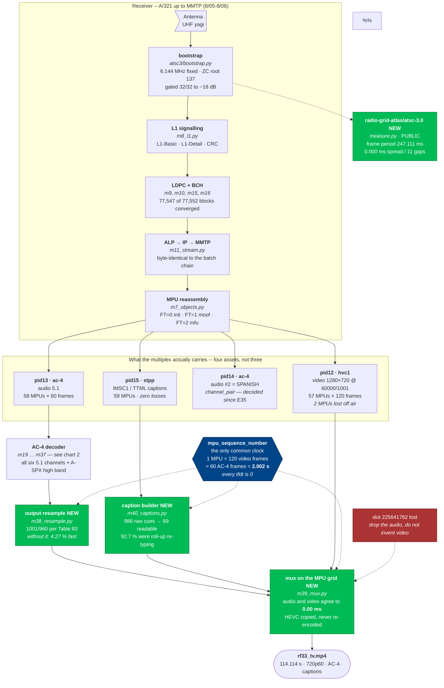
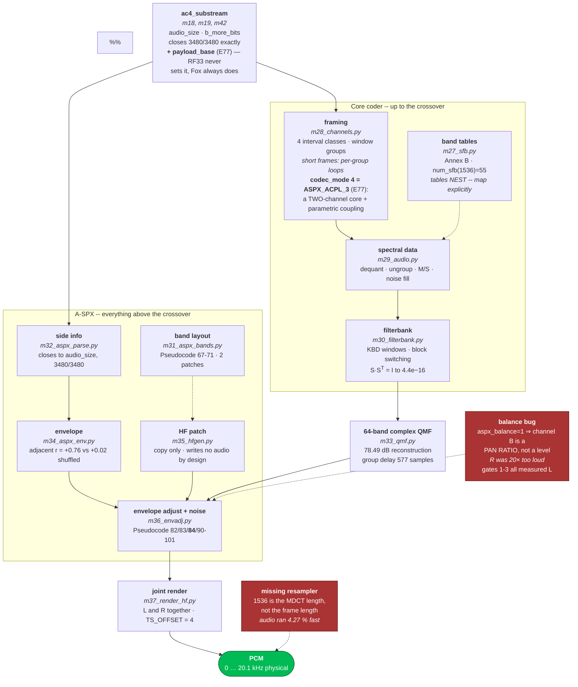

# ATSC 3.0 → television : architecture

Built 8/05–8/07. Two charts: the whole journey from photons to a watchable
file, then the AC-4 audio decoder on its own, because that is where most of
the new work went.

Solid arrows carry data. Dashed arrows carry control, timing or gates.
Boxes marked **NEW** landed 8/07.

> **This file is the 8/07 "first television" snapshot**, kept because it is the
> clearest single picture of the offline path that produced `rf33_tv.mp4`.
> For the system as it stands now — live chain, supervision, LDM, clocks — see
> [docs/ARCHITECTURE.md](docs/ARCHITECTURE.md); for the standard itself, see
> [docs/HOW-ATSC3-WORKS.md](docs/HOW-ATSC3-WORKS.md). Claims below that time
> has overtaken are corrected in place and marked.

---

## 1. RF to television

---

## 2. The AC-4 decoder

---

## What the charts do not show

Counted, not hidden. Rows struck through were true on 8/07 and have since been
closed; they are kept rather than deleted so the record stays legible.

| gap | size |
|---|---|
| additional harmonics | &lt;1.5 % of channel-frames &mdash; `SineTable` is not in the spec document we have |
| limiter tie-breaking | Pseudocode 72, partial |
| A-CPL | ~~not signalled on this service~~ &mdash; **superseded (E77)**: Fox signals `5_X_codec_mode 4` = ASPX_ACPL_3. We now parse the two-channel core and render it as correct stereo; `acpl_data_2ch` and a QMF-domain A-CPL synthesis stage are still missing, so the 5.1 upmix of *that* stream is not reachable yet |
| companding | signalled, not applied |
| `sap_mode 3` full SAP | 91 frames |
| SSF speech frontend | never used by this stream |
| ~~**pid14, the second audio**~~ | **CLOSED (E35)**: it is the Spanish programme, a `channel_pair` element, decoded and offered as a selectable audio track in the live viewer |
| ~~**32.1**~~ | **CLOSED (M13)**: subframe 1 / PLP 1 is demodulated and gated — 468/468 FEC blocks BCH-zero over 4 frames, later 1872/1872 over 16. It carries five ROUTE/LCT flows and four additional 1080p60 services. Live playback of PLP 1 is still blocked on real-time cost, not on the physical layer |

Two further limits worth naming, both measured after this document was
written:

| limit | number |
|---|---|
| full 5.1 AC-4 in real time | discrete-verified on all six channels, but **0.62x** even threaded — recordings only. Live runs the stereo pair at 1.27x |
| PLP 1 live | the 64800 path is the cost; the demapper, not the LDPC, becomes the bottleneck |
