# ATSC 3.0 Receiver — Architecture

The signal path from antenna to screen, the dual CPU/GPU engine, and the
supervision layer that keeps it alive unattended.

New to ATSC 3.0? Read [HOW-ATSC3-WORKS.md](HOW-ATSC3-WORKS.md) first — it
explains the standard. This file explains the build.

Every box below corresponds to code in this repository, cited `file:line`
where it helps. Anything measured says so and gives the number; anything
in progress is labelled in progress. Diagrams are verified against the source
as of 2026-08-11 (E84).

---

## 1. The signal's journey, physically

Before any DSP, the RF has to survive the front end — and on this site that
turned out to be the single largest lever in the whole campaign.

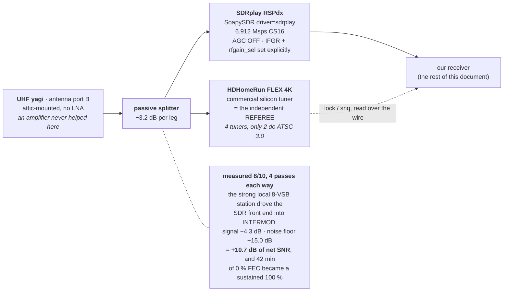

Counterintuitive and measured: on an **overloaded** front end, throwing signal
away is therapeutic. The starvation model predicts the opposite and was wrong
here, which is also why an LNA never helped this site. The 8-VSB control
carrier moved by exactly the insertion loss (−3.2 dB), which is how we know
the splitter is really in circuit and costing what it should; a 3.2 dB pad
should drop third-order products by ~9.5 dB and the floor fell 15.0 dB, so the
attribution is honest but not surgical.

The receiver noticed on its own: post-splitter, the adaptive notch measures
the out-of-band ratio at 0.0040–0.0045 and **bypasses itself entirely**, where
pre-splitter it read 0.075 healthy and 0.28–0.43 while broken. There is no
longer out-of-band energy worth notching.

The second leg is not a spare. It is the instrument that makes the rest of the
supervision layer possible: a receiver cannot referee itself, and section 7
depends on having a second opinion about the air.

### Gain is per-carrier, looked up, and verified by readback

One gain setting cannot serve two carriers. RF33 wants `rfgain_sel 4`
(measured 0.0 % FEC at 2 versus 100.0 % at 4); RF25 wants `rfgain_sel 2`
(+6.05 dB of median SNR over 4). The table is data, not code
(`lab/carrier_gain.json`), and the chain consults it on tune.

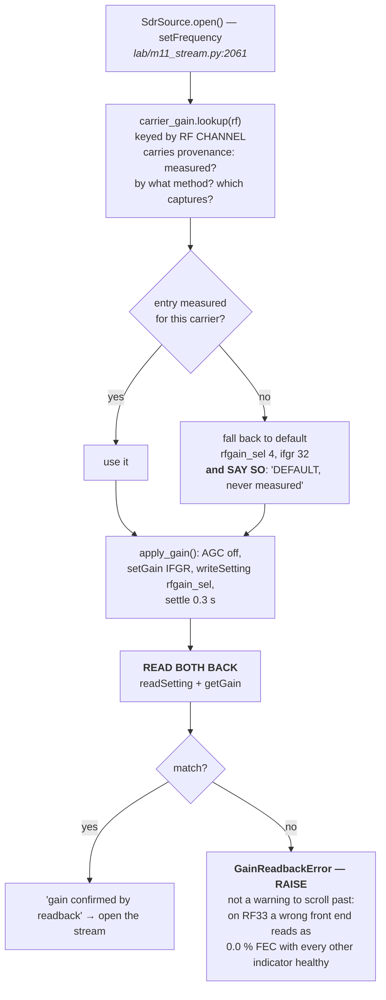

`lab/carrier_gain.py:125-174`, integrated at `lab/m11_stream.py:2060-2072`.

The default was chosen on **asymmetry of harm**, not preference: a wrong 4
costs some margin, a wrong 2 can cost the entire carrier
(`lab/carrier_gain.json:20-27`).

> **Law.** An unverified `writeSetting` is a hope, not a setting. This is
> enforced by a raise, because the failure it prevents is invisible — the
> radio reports success and the decoder reports a dead channel.

---

## 2. The receive chain

RF samples in, media lanes out. This is one process; the fan-out inside it is
section 3.

```mermaid
flowchart TD
    SDR["<b>SdrSource</b> &middot; 6.912 Msps CS16<br/>sacrificial first read discarded"]
    SDR --> BOOT["<b>A/321 bootstrap detect</b><br/><i>atsc3/bootstrap.py</i><br/>TWO detectors: structural (assumption-free)<br/>+ matched (gives the signalling bits)<br/>gated 32/32 down to &minus;18 dB"]
    BOOT --> CFO["coarse CFO (3 kHz bins, &plusmn;10)<br/>+ fine CFO from the lag-2048 phase"]
    CFO --> FE["<b>front end</b> (E53/E55 fast paths)<br/>FineTrack: a timing LINE, not a 41-point scan<br/>&mdash; 1.2 FFTs/frame amortised vs 41<br/>adaptive notch: measure once per lock, then<br/>BYPASS or FFT overlap-save on the decode WINDOW<br/>derotate from a cached CFO ramp"]
    FE --> PRE["<b>preamble</b><br/>geometry from the bootstrap's own<br/>preamble_structure field (A/322 Table H.1.1)<br/><i>never guessed</i>"]
    PRE --> L1B["<b>L1-Basic</b> &middot; QPSK<br/>BCH-168 + LDPC 3/15, Ninner 16200<br/>Mode 1 also carries PARITY REPETITION<br/>(Nrepeat 3672 &mdash; 48 % of the word)"]
    L1B --> L1D["<b>L1-Detail</b><br/>BCH-168 + LDPC 3/15 (modes 1-2)<br/>or 6/15 Type B (modes 3-7)<br/><i>every geometry parameter below comes from here</i>"]
    L1D --> GEO["<b>cell pool per subframe</b><br/>pilots, null edge cells, dummy tail<br/>pool == sum(plp_size) + dummy, CHECKED"]
    GEO --> TI{"time interleaver<br/>TI mode from L1"}
    TI -->|"mode 2: HTI"| ENGINE
    TI -->|"mode 1: CTI"| LDM["<b>LDM / CTI stage</b> &middot; <i>lab/m44_ldm.py</i><br/>streaming de-interleaver + PHASE TRACKER<br/>phase from L1, then dead reckoning,<br/>then a bounded sweep &mdash; FEC syndrome arbitrates"]
    LDM --> ENGINE
    ENGINE{"decode engine &mdash; see section 3<br/>--accel cpu | gpu | gpu-full<br/><i>production pins cpu</i>"}
    ENGINE --> BCH["<b>BCH + descramble</b><br/>baseband packets"]
    BCH --> ALP["<b>ALP</b> &rarr; IP datagrams<br/>every length bounded (MAX_ALP 65600)<br/>+ a cross-layer IPv4 sanity gate"]
    ALP --> TRANS{"transport"}
    TRANS -->|MMTP| MMTP["<b>MPU assembly</b> &middot; <i>lab/m11_stream.py</i><br/>every header field BOUNDED<br/>(no-CRC law &mdash; section 4)"]
    TRANS -->|"ROUTE (opt-in: --route)"| ROUTE["<b>RouteStream</b> &middot; LCT &rarr; DASH segments<br/>complete-or-dropped-whole (E47)"]
    MMTP --> LANES["<b>fMP4 lanes + live.json</b><br/>video / audio / subs<br/>roll-not-truncate, gap-true index"]
    ROUTE --> LANES
```

Three things this diagram fixes versus the previous version of it:

- **The tuning step now consults the gain table** (section 1). It did not when
  the old chart was drawn.
- **The ROUTE branch is opt-in.** The live chain emits zero ROUTE lanes unless
  `--route` is given; `lab/gate_e47.py:23-27` proves it by negative control.
  The old chart drew both branches as equally live.
- **The accel values were wrong.** The old chart said `cpu | gpu-full`; there
  are three (`cpu`, `gpu`, `gpu-full`), the default is `gpu-full`, and the
  production launcher pins `cpu`. `cpu_fast` is not an accel value at all — it
  is a derived boolean meaning "`--accel cpu` and not `--exact-cpu`".

### The multiplex identifies itself — no channel numbers in the decode path

At tune time a 0.75 s sniff decodes L1 and asks two questions: is there a
Layer-1 PLP (LDM?), and does the core PLP signal TI mode 1 (CTI?). Both yes
routes to the LDM stage; anything else takes the legacy path. The sniff
**replays its own samples** into the front end, so a multiplex that takes the
legacy path sees a byte-identical sample stream.

There is no `if rf == 25` anywhere in the decode path. Layer, modulation, code
rate, Ninner, CTI depth, commutator phase and frame length all come from the
decoded L1-Detail.

**Status — landed 8/11 (E82), not yet exercised on live air.** The LDM path is
wired into the live chain and gated (16 legs, 6 controls, `lab/gate_e82.py`),
and it reproduces E76's offline number exactly — 6962/6962 FEC blocks,
100.0 % BCH-clean — through the live chain rather than a batch tool. But that
was **banked** captures replayed through the real front end. It has never run
on live RF25 air, and at **0.48x** of real time it cannot until either the GPU
LDPC path or a demod process pool is written; on live air a shortfall like
that is not "slow", it is dropped frames. RF33's datagram SHA-256 is unchanged
by the work (`bd767637…ab4d`), which is how we know the new path did not
disturb the old one.

---

## 3. The decode engine

The FEC layer is where the compute is. It has two backends, and the CPU one is
the one that ships.

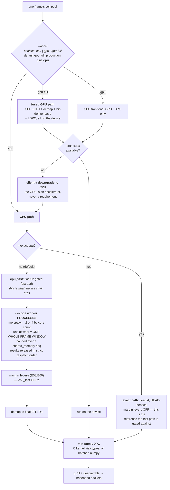

### The GIL law

> **Measured.** The GIL caps decode **threads** at about 1.2x on any core
> count — this chain is gather/scatter-heavy and NumPy holds the GIL for
> advanced indexing. Going from 1 to 6 threads bought **36 %**. Three
> **processes** bought **~2.2x**.

So the fan-out is processes, not threads, and the unit handed across is a whole
frame window in shared memory rather than a queue of small objects. Results are
parked in a dict and released only from the head of the dispatch order, which
is what lets the parallel path claim byte-identity with the serial one.

Threads still do useful work *inside* a worker — LDPC blocks are sliced across
a thread pool, demap runs in chunks of 8 blocks, the cell pool parallelises per
pilot class — because those sections are inside NumPy and do release the GIL.

BLAS thread pinning is real but it is a **deployment** property, not something
the engine does to itself: the launchers and the warden export
`OMP/OPENBLAS/MKL_NUM_THREADS` (4 for a decode worker, 1 for the audio and
viewer stack, where pinning measured the difference between 0.09x and 9.56x).
The previous version of this diagram put pinning inside the engine box; it is
not there.

### The C kernel and its fallback

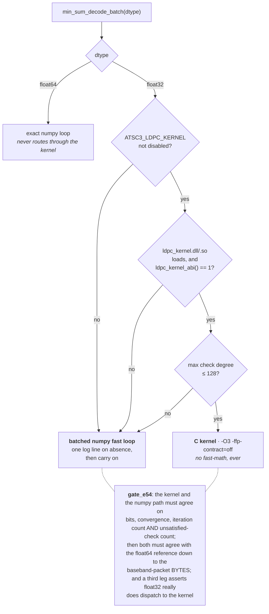

Min-sum as actually implemented: **normalized, flooding** (not layered),
default 50 iterations, with an **alpha ladder** — 1.0, then 0.85, then 0.75 —
tried until the syndrome is zero, and if no rung converges the rung with the
fewest unsatisfied checks wins.

Two optimisations that matter for throughput:

- **Fused syndrome check** (float32 path): the syndrome is computed from the
  *same* gather the variable update needs, and *before* any message update — so
  a block whose channel hard decisions already satisfy every check retires at
  iteration 0 having done no belief propagation at all.
- **Per-row early retirement**: converged blocks are sliced out of the active
  batch mid-loop, so the batch shrinks as the frame resolves.

### Where the margin levers sit, and where they do not

The E58/E60 levers recovered +1.61 dB of effective threshold on the banked Fox
capture (176 → 1056 blocks decoded). They are **default-ON in the cpu_fast
path and default-OFF everywhere else** — including exact-float64 and both GPU
backends, which run pre-E60 code.

| lever | default | engaged |
|---|---|---|
| time-smoothed 2x1D channel estimate, window ±12 symbols | **on** | always, in cpu_fast |
| per-symbol complex-gain normalisation | **on** | always, in cpu_fast |
| relative + absolute change detectors (fall back per cell when the channel really moved) | **on** (6.0 / 10.0) | always, in cpu_fast |
| per-cell noise-weighted LLRs | **armed** (`auto`) | only when the frame's dummy-cell SNR is below **16.0 dB** |
| exact sum-product rescue of near-miss blocks | **on** | blocks with fewer than 1500 unsatisfied checks, at most 8 per frame, inside a 120 ms box |

A single environment variable (`ATSC3_MARGIN=0`) or `--no-margin` turns the
whole set off, which is what the gate uses to prove the levers change decoded
bytes only where they are supposed to: with levers on, the end-to-end SHA still
matches HEAD's on strong air, and the weighted-LLR lever engages on 0–3 frames
out of a run.

---

## 4. Two transports, side by side

We implement both. The commercial tuner on the other leg of the splitter
presents only one, which caused a real misreading of our own results once.

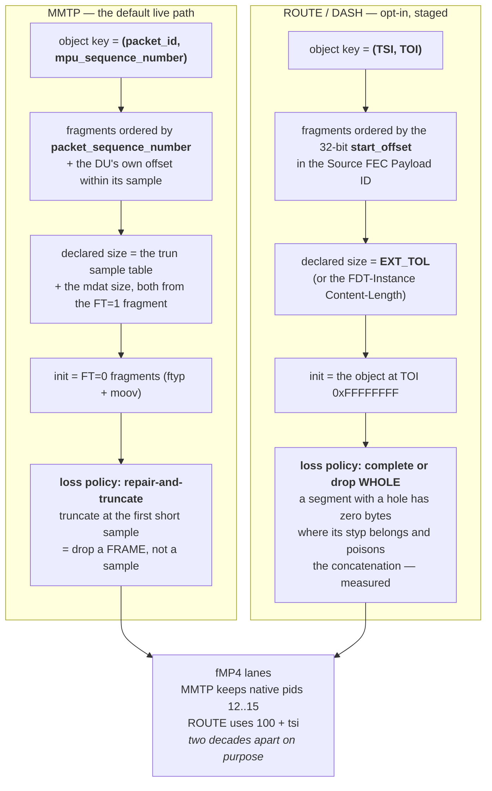

Verified at `lab/m7_objects.py:389,435-444` and `lab/m11_stream.py:547-565`
(MMTP) against `lab/m7_objects.py:142,149` and `lab/m11_stream.py:627-631,
704-727` (ROUTE).

The two loss policies are not an inconsistency — they follow from the
container. An MPU's sample boundaries are known from its own trun table, so a
partial MPU can be truncated at a real boundary. A DASH segment's internal
structure is not recoverable from a hole, so it goes or it does not.

### Signalling: how a service is found

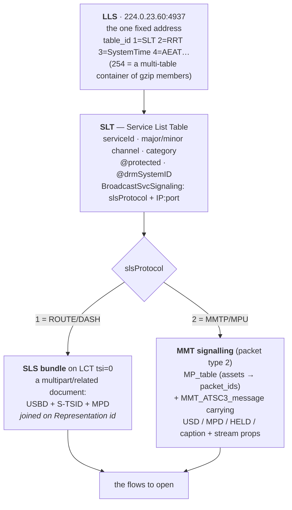

Two fields are **derived, never signalled**, and the code says so rather than
inventing them: the RF channel a service was heard on (attributed from the
capture, `tools/atsc3_inspect.py:1164-1190`) and the PLP it rode (attributed
from the decode artifact, `:677-696`). Both return their derivation chain;
anything unmapped reports `unknown`.

---

## 5. Every field from the air is bounded

ATSC 3.0's transport headers carry **no CRC of their own**. A bit that
survives the channel but not the fade is read as truth. This is a whole class,
not two bugs, and it is why the transport code looks paranoid.

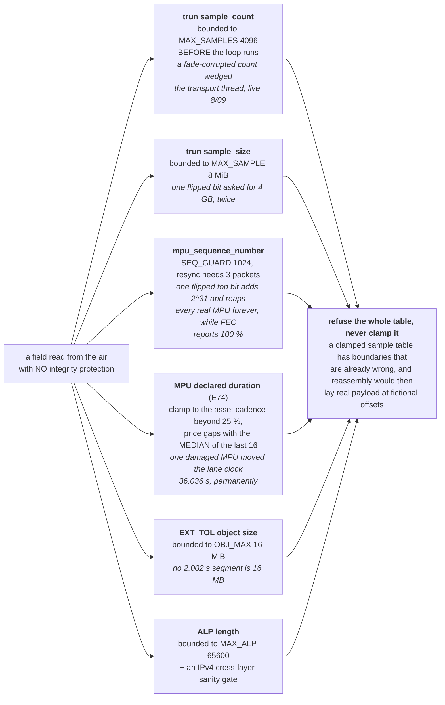

Citations: `lab/m7_objects.py:296-297,327-356`, `lab/m11_stream.py:417-476`,
`lab/m7_route.py:106-126`, and the E74 clamp at `lab/m11_stream.py`
(`_bound`/`_nominal`, commit `d4a28d2`).

Twenty-two bounded fields are catalogued in the transport layer. One gap is
known and recorded rather than hidden: `IpReasm.frag`
(`lab/m7_route.py:281,305-321`) accumulates incomplete fragment chains with no
cap and no timeout. It is offline batch code, so the exposure is bounded by
run length, but it is the one place the law is not applied.

---

## 6. The viewing stack

Lanes are files. Turning files into one watchable window is a surprising
amount of the work.

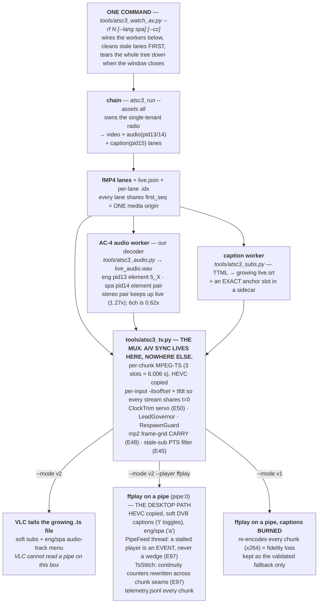

Two design rules carry most of the weight here:

**Drop a frame, never a sample.** A corrupt video fragment is dropped and
becomes a gap; the chunk is still emitted. A dead chunk is worse than a
freeze.

**A missing second language must never fail the chunk.** Spanish is not waited
on; English is, but only for a bounded 75 s, after which the chunk goes out
with silence rather than freezing the picture.

**LAW &mdash; do not hand-roll the mux.** `atsc3_tv.py` is the ONE place A/V
sync lives. A 2026-08-22 detour fed raw PCM (no timestamps) into a private
ffmpeg with no clock servo: the audio slid seconds behind the video (a
commercial on screen, the football on the speakers), and the captions floated
in a monitor-centred window instead of over the picture. The fix was not to
patch that pipeline but to DELETE it and route every viewer through
`atsc3_tv.py` (`--mode v2 --player ffplay` on the desktop, `--mode v2` VLC
where VLC exists, `--mode v1` only as the burned-caption fallback). If a new
front-end needs a window, it feeds `atsc3_tv.py`; it does not re-implement the
chunk mux, the `-itsoffset` alignment, or the ClockTrim servo. Reinventing
those is how this breaks over and over.

Three seam laws learned 8/22 (E95/E96/E97), all in `atsc3_tv.py`:

* **Never burn captions to get them on screen.** Burning forces a re-encode
  of every chunk; the broadcast HEVC must reach the player untouched. Soft
  DVB subtitles render in ffplay and VLC alike.
* **A chunk seam must be invisible in three clocks at once**: timestamps
  (the `-itsoffset`/tfdt arithmetic), the audio sample grid (the E48 mp2
  carry -- 6.006 s is 250.25 frames, so chunks go 250/250/250/251), and the
  TS continuity counters (`TsStitch`). Any one of them wrong = a hitch
  every 6 s that looks like "the signal".
* **Ship the centre channel.** The live path once decoded L/R only and
  called it stereo: the centre -- dialogue, 4 dB hotter than L/R on air --
  was dropped (E98). The 5.1 main now rides as AC-3 640k (the TS-native
  5.1 codec, 1.87x realtime from our decoder on the desktop), the SAP as
  mp2, both decoded by their own worker; the frame grid becomes
  lcm(1152, 1536) = 4608 so AC-3 and mp2 butt-join together. A stereo
  output still gets the centre, because the player's downmix includes it.
* **The player is an output.** The muxer feeds it through `PipeFeed` and
  never blocks on it; a stall is logged to `_tv/telemetry.jsonl` and the
  player is respawned at the live edge (stampede-gated). When the user
  says "it skips" or "it froze", read the telemetry before theorising.

---

## 7. Time and clocks — the hardest subject in the campaign

If you understand one diagram in this document, make it this one. Most of the
bugs worth naming were clock bugs, and each survived because some other
instrument said everything was fine.

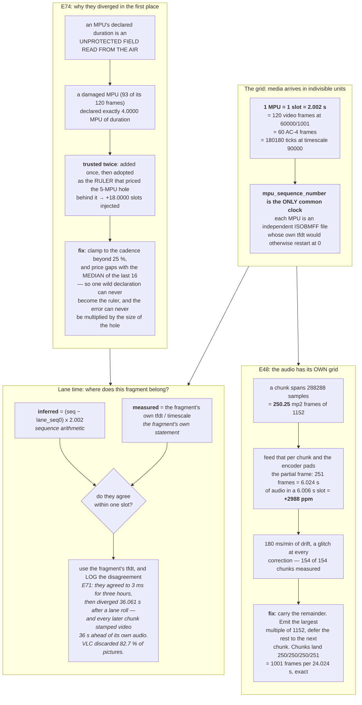

### The three clocks, and why a servo beats a watchdog

The TS is stamped on the **broadcaster's** clock. VLC consumes on **its** clock
(in practice the audio card's). The **SDR crystal** sits in between. Any ppm
disagreement makes the cushion drift linearly and forever.

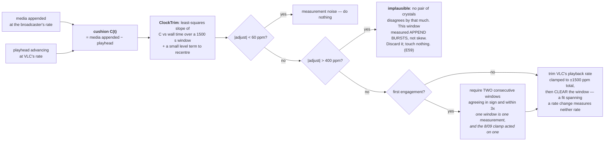

`tools/atsc3_tv.py:663-776`. Discontinuities — pause, respawn, lane roll, a
governor hold — all poison the fit, so the window resets on every one. The
controller only ever acts on evidence from an unbroken stretch of playback.

> **Law.** Watchdogs for faults, servos for clocks. Before E50 the
> pause/rebuild machinery "fixed" a deterministic rate error with a lurch every
> few minutes, forever — a watchdog treating physics as a fault.

### The cushion, in numbers

| knob | default | in production (set by the warden) | what it buys |
|---|---|---|---|
| `--lag` | 25 s | **120 s** | how far behind the lane head the muxer works — deep lag absorbs band fades |
| `--lead` | 24 s | **60 s** | media banked ahead of the playhead before the window even opens |
| `--chunk` | 3 slots (6.006 s) | 3 slots | mux granularity |
| `--audio-hold` | 75 s | 75 s | how long a chunk waits for its English audio before going out silent |

### The rules that came out of all this

- **Walk the slot RANGE, never the present fragments.** The audio slice for a
  span is indexed by slot, anchored at the wav sidecar's `first_seq`. A lost
  MPU then becomes a freeze and a silence, not a permanent shift.
- **Carry fractional frames.** Both in the mp2 grid (above) and in the timing
  tracker, where the fractional part of the per-frame drift is carried rather
  than dropped.
- **Caption time is not lane time.** `live.srt`'s zero is the subs worker's own
  start. The worker records the MPU slot of its `t=0`, and the viewer converts
  `cue_lane_t = cue_t + (anchor_seq − lane_seq0) × 2.002`. Before that
  conversion existed, v1 missed every cue.

---

## 8. Supervision: who watches what, and how they avoid lying

The layer that keeps it alive unattended. The recurring bug class was
**circular checks** — asking a component's own output whether that component
works — and **vacuous checks** that switch themselves off in exactly the state
they exist for.

```mermaid
flowchart TD
    WARD["<b>atsc3_warden</b> &mdash; one loop, one census, 15 s<br/>7 roles: run &middot; eng &middot; spa &middot; subs &middot; viewer &middot; vlc &middot; tvwatch<br/>liveness by EXACT cmdline, self-excluded,<br/>and matched on --live-dir OWNERSHIP"]

    WARD -->|"lane advancing AND ts mtime frozen 180 s<br/>AND enough media exists to have filled the cushion"| VIEW["restart the viewer"]
    WARD -->|"lane advancing AND no window for 300 s"| VIEW
    WARD -->|"lane stalled 180 s"| WAIT["<b>do nothing</b><br/>no signal is not a fault"]
    WARD -->|"lane grew 1 MB over 600 s<br/>while the wav never moved"| WORK["restart that audio worker"]
    WARD -->|"VLC alive but 4 consecutive<br/>HTTP status probes fail"| PLAYER["unwedge the player"]
    WARD -->|"chain gone"| RUN["respawn atsc3_run"]
    WARD --> ORPH["sweep orphaned worker forks<br/><i>42 leaked forks once dragged<br/>the chain to 0.41x real time</i>"]
    WARD --> STAMP["<b>stampede gate</b>: 4 restarts in 60 min<br/>stands THAT ROLE down and keeps the rest alive"]

    JUDGE["<b>atsc3_judge</b> &mdash; independent referee<br/>never restarts anything; only judges<br/><b>QUALIFIED clock</b>: banks soak time only<br/>while the air is actually delivering"]
    JUDGE --> I1["(i) one of each role, within its budget<br/>run 90 s &middot; workers 180 s &middot; viewer 120 s"]
    JUDGE --> I2["(ii) a player exists and ANSWERS<br/>band-excused, never viewer-excused"]
    JUDGE --> I3["(iii) the TS grew &mdash; judged only over time<br/>output was actually OWED (E77)"]
    JUDGE --> I4["(iv) no role restarted more than 4x/h"]
    JUDGE --> I5["(v) hourly A/V cross-correlation &gt; 0.95<br/>(vii) A/V PTS skew &lt; 2.0 s"]
    JUDGE --> I6["(vi) RF REFEREE, every 5 min"]
    HDHR["HDHomeRun FLEX 4K on the other splitter leg"] -.->|"lock + snq"| I6
```

`tools/atsc3_warden.py`, `tools/atsc3_judge.py`. Corrections to the previous
version of this diagram: there are **seven** roles, not six; there are **seven**
invariants (i)–(vii), not five; and the referee edge is **snq + lock**, not
`ss` — signal strength is logged everywhere and is a decision input nowhere.

### The two rules that took the longest to learn

**Judge a thing only over the time it had a fair chance to do it.** The
ts-growth invariant compared "FEC is good *now*" against "the TS grew over the
last 400 s". When the radio came back from a scheduled yield, the history was
still full of legitimately flat samples, and the invariant convicted a stack
that was behaving perfectly — three minutes after the judge's own log said
`ours FEC n/a`, while the TS was growing at 2.5 MB/s. The history may now only
contain time during which output was actually **owed**: band up *and* the radio
ours (`tools/atsc3_judge.py:563-596`).

**A violation must reset the bar.** Before E63, `violate()` reset a timer that
no longer fed the pass condition, so a run could reach "6 h clean" having
failed repeatedly. `gate_e61.py:579-591` resurrects the pre-fix function body
as a mutant and requires the gate to catch it.

### Fade or overload? Only an independent referee can tell

This is the distinction that E73 forced, and it is worth its own diagram
because from the inside the two are **identical**: 0 % FEC with frames still
advancing.

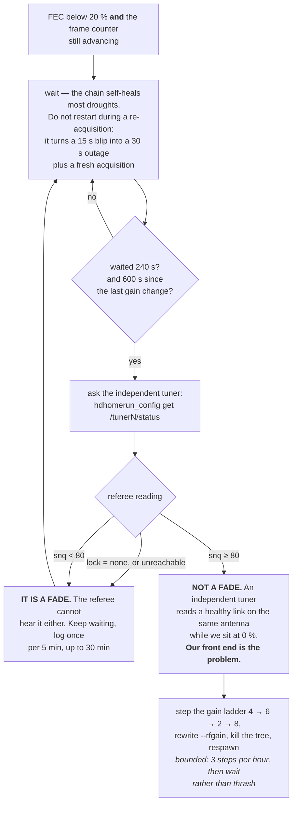

`tools/atsc3_run.py:473-538`. The referee returning `None` (no lock) is
treated as a real fade, not as an inconclusive result — a referee that cannot
lock either *is* evidence about the air.

This distinction paid for itself immediately. The night RF33 "faded" between
19:56 and 22:10 turned out to be substantially **our own front end**: after the
splitter, the same historical floor hours read 100.0 % decodable over 594
minutes while the referee's own snq was marginally *worse* than the night
before. The improvement was ours, not the sky's.

---

## 9. Protection: what is locked, and how we know

Some services on RF33 are DRM-protected. This receiver **detects protection and
refuses**. It contains no decryption code of any kind, and the detection is
deliberately built from four independent signalling layers so that "it is
encrypted" is a finding with evidence rather than an assumption.

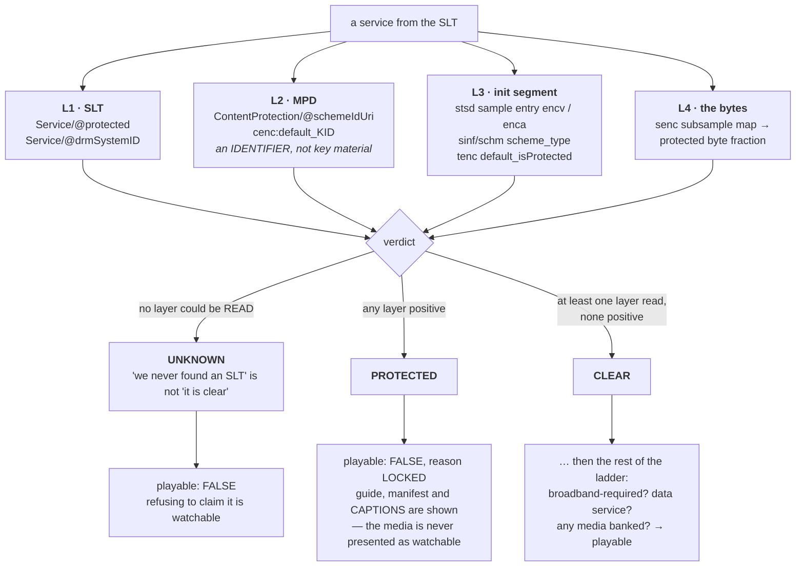

`tools/atsc3_inspect.py:715-826` (classification) and `:831-876` (playability).

The asymmetry is deliberate: `PROTECTED` needs **one** positive from any layer,
while `CLEAR` requires that at least one layer was actually parsed and none
were positive. Absence is evidence too — but only when the document that would
have carried the evidence was actually read.

**Captions of a locked channel stay in the clear and are legitimately shown.**
On the locked services, tsi40 is a plain `stpp` sample entry while the video is
`encv`. Gate leg 6 of `lab/e70_gate.py:234-265` requires *both halves* — cues
actually recovered **and** `stpp` on text **and** `encv` on video — because
either half alone is a hollow claim.

**We verify we refuse.** The gate mutates the signalling rather than the
service name (rename must stay PROTECTED, strip fields must become CLEAR,
plant `@protected` must become PROTECTED, read nothing must become UNKNOWN);
it injects a deliberately regressed `decide_playable` that checks media before
protection and requires the leg to catch it; and it scans the rendered HTML for
play *affordances*, planting a "Watch now" link to prove the scan can see one.

Finally: `(no data)` in a commercial tuner's scan tracks **slsProtocol**, not
protection. That tuner presents MMTP only. Reading it as an encryption flag
reversed one of our own conclusions once, and that reading is now retracted in
place.

---

## 10. The gate culture, drawn

Sixteen laws exist because of the difference between these two shapes. It is
the most transferable thing in the repository.

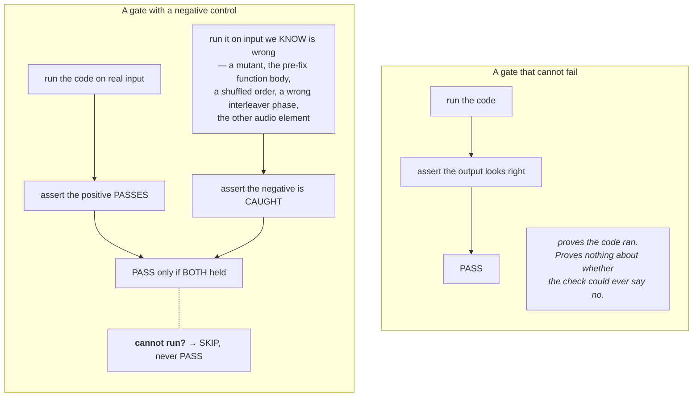

> **House law**, stated in the code itself: *a gate that cannot fail proves
> nothing. Every leg carries at least one negative control — an input that
> SHOULD make the check fail — and the leg only passes if the positive passes
> AND the negative is caught.* (`lab/e70_gate.py:4-6`)

Thirty-one gate scripts live under `lab/`. There is no shared gate framework —
each is a standalone script that imports the **shipped module under test**, so
a gate exercises production code rather than a copy of it. The negative control
is a first-class field of the machine-readable verdict:

```python
def leg(name, ok, detail, control=None):
    legs.append({"leg": len(legs) + 1, "name": name,
                 "verdict": "PASS" if ok else "FAIL",
                 "detail": detail, "negative_control": control})
```

Real controls from the repository, chosen to show the range:

| gate | the control that must fail |
|---|---|
| `gate_e50` (clock servo) | run the identical simulation with the servo **off**; it must drain past 2.5 s |
| `gate_e61` (process reaping) | the leak itself: bare `terminate()` must be re-measured leaking its child, every run |
| `gate_e61` (soak bar) | the **pre-fix `violate()` body**, resurrected as a mutant subclass, must be shown not to reset the bar |
| `gate_e61` (fade logic) | FEC high with lanes dead must **not** be excused as a fade; frozen frames must **not** be excused either |
| `e70_gate` (DRM) | a regressed `decide_playable` that checks media before protection must be caught lying |
| `e81_gate` (scoreboard) | dropping our own null samples is shown to inflate our uptime — the exact self-flattery the rule prevents |
| `gate_seq_poison` | two-sided: poison must be rejected **and** a genuine broadcaster counter reset must still be followed |
| `e82_media_gate` | each audio element returns 0/200 on the *other* element — a free negative control |

Three more habits worth stealing:

- **A gate that cannot run SKIPs, never passes.** "A leg that quietly passes
  itself when it cannot run is the vacuity bug this campaign keeps finding."
- **A broken harness invalidates itself** and returns 2: *"GATE INVALID — the
  harness cannot even pass a clean stream."*
- **Gates are polite.** They drop to below-normal priority and refuse to run at
  all if the live soak's instantaneous rate is below 0.95x — then re-check
  afterwards, so a gate that damaged the soak says so.

---

## 11. Performance (measured, N≥3 medians)

| platform | engine | sustained | note |
|---|---|---|---|
| Threadripper 2990WX | CPU only | 2.66x | 4 worker processes; ~4 % box load, BLAS pinned |
| Threadripper 2990WX | gpu-full | 1.48x | optional accelerator, never required |
| Ryzen 1600X (6-core) | CPU only | 1.02x live | full TV including the viewer (E56) |
| Pi-5 class | CPU only | ~1.2–2x **estimated** | not measured on hardware |
| RF25 LDM/CTI path | CPU only | **0.48x** | in progress; blocks the live Fox trial |

AC-4 output rates, measured: stereo `--channels 2` runs 1.27x and keeps up
live; full 5.1 `--channels 6` runs 0.62x even threaded and is therefore
recordings-only until the filterbank is faster. The 5.1 decode itself is
discrete-verified — all six channels — it simply cannot yet be done in real
time.

---

## 12. Service map (RF33, bsid 540 — decode status, not aspiration)

| sid | service | transport / PLP | status |
|---|---|---|---|
| 2 | WJLA 7.1 | MMTP / PLP0 | **live**, full TV: video + eng/spa AC-4 + captions |
| 1 | WHUT 32.1 | ROUTE / PLP1 | decoded offline; live blocked on real-time subframe 1 |
| 3, 4, 5 | WTTG, WRC, WUSA | ROUTE / PLP1 | **LOCKED** — Widevine, verified on 4 layers, not pursued |
| 65024 | service guide | ROUTE | decoded — hundreds of programmes from ~60 s of air |

Other carriers reached from this site:

| carrier | what it is | status |
|---|---|---|
| RF25 | Fox Baltimore 45.100, **LDM core layer** | decoded 100.0 % (6962/6962) offline and through the live chain on banked air; live trial pending real-time |
| RF30 | LDM, core carries datacast + GNSS RTK + LLS | core decoded 740/740; both TV services ride the **enhanced** layer, measured 9.3 dB out of reach |

---

## Where the laws are

The reasoning behind every design decision above — E35 through E84, including
the ones that were later reversed — lives in `lab/LIVE_TV_LAB.md`. A recorded
failure there is a reference, not an authority; several have been reopened and
overturned by better evidence, and they are corrected in place so the mistake
stays legible.
