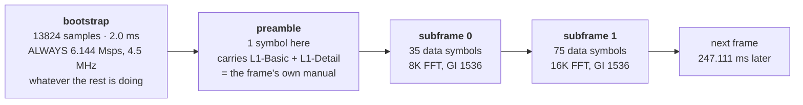
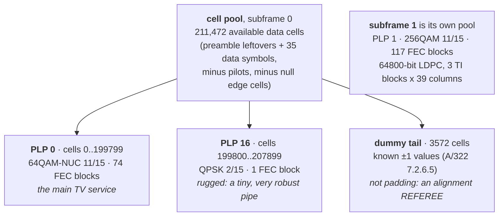
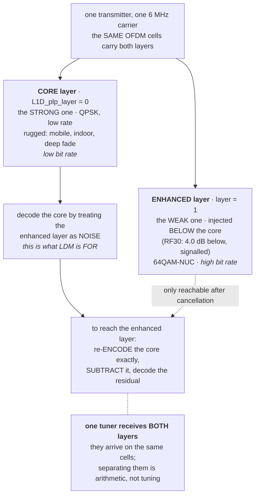
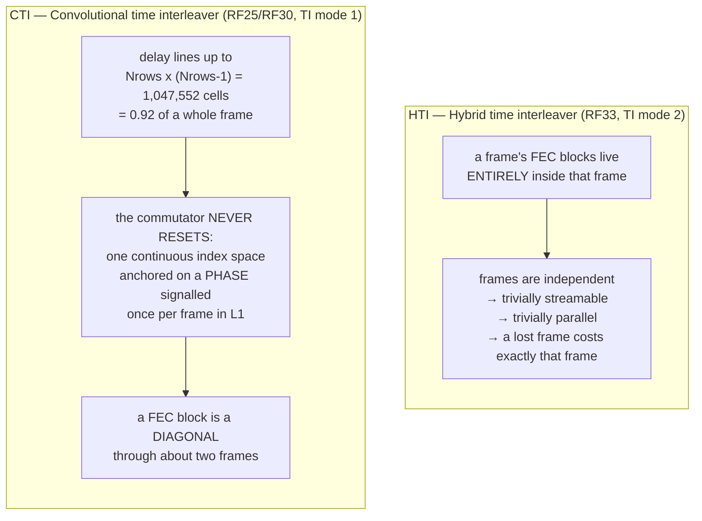
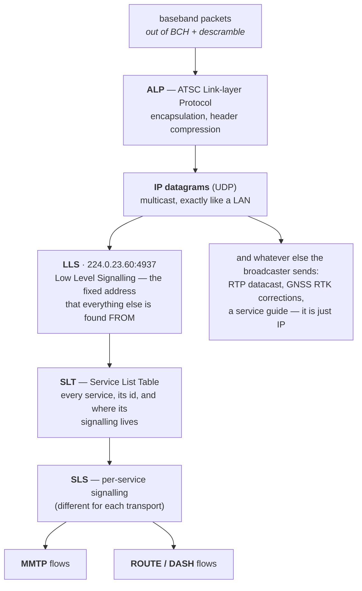
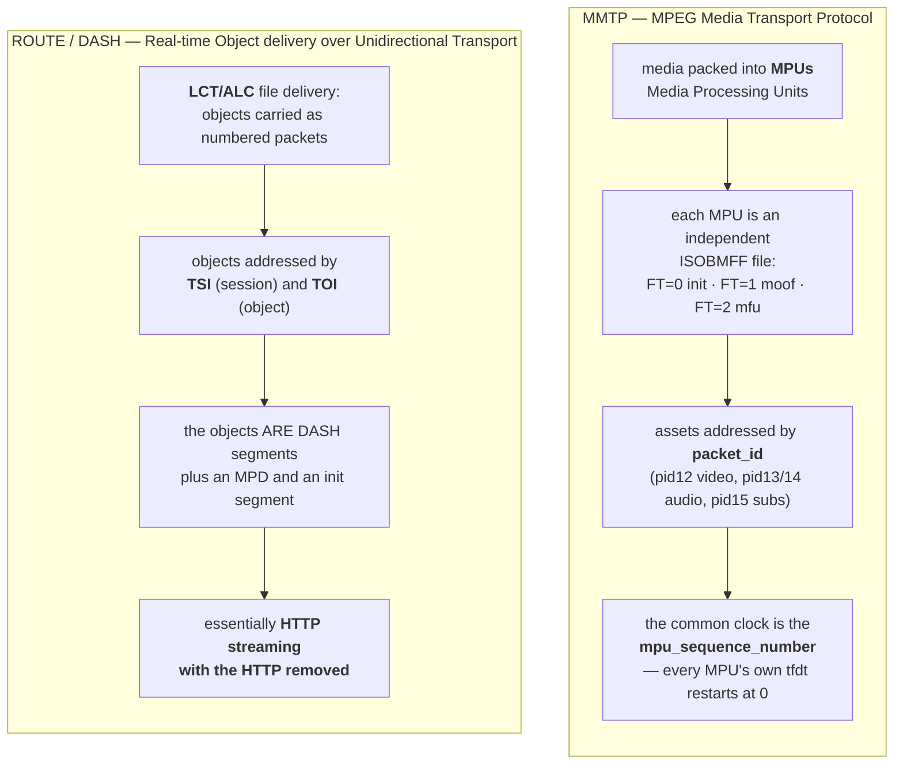

# How ATSC 3.0 works, and what a receiver has to do about it

For a reader who has never met ATSC 3.0 ("NextGen TV"). It explains the parts
of the standard this receiver actually implements, in the order the signal
meets them. Every number is one this codebase reads or measures; the file it
comes from is named next to it.

Engineering detail — process layout, the decode engine, supervision — lives in
[ARCHITECTURE.md](ARCHITECTURE.md). This file is the standard, not the build.

---

## The one-sentence version

An ATSC 3.0 station transmits **IP packets over the air** inside a 6 MHz TV
channel, using OFDM and modern FEC; a receiver's job is to turn radio into
those IP packets, and then to behave like a small, very unreliable network.

Everything below is a consequence of that sentence.

---

## 1. One carrier, one repeating frame

A station occupies one 6 MHz RF channel. Time on that channel is divided into
**frames**, and every frame has the same three-part shape.



Those are RF33's real numbers, read off its own L1 and confirmed against the
waveform: `lab/m6_cells.py:108` computes the frame as
`13824 + 36*(8192+1536) + 75*(16384+1536)` samples at 6.912 Msps = **1,708,032
samples = 247.111 ms**, and `radio-grid-atlas/atsc-3.0` measured the frame period on
air at 247.111 ms with 0.000 ms of spread. Frame arithmetic and the air agree.

Two things a newcomer should take from this picture:

**The bootstrap is fixed and the rest is not.** The bootstrap is transmitted
identically by every ATSC 3.0 station on earth, at a fixed 6.144 Msps and
4.5 MHz *regardless of the channel bandwidth* (`atsc3/bootstrap.py:5`). That is
deliberate: it is the part you can find without knowing anything. Everything
after it is configurable, and the configuration is signalled in the preamble.

**A frame can change shape halfway through.** Subframe 0 and subframe 1 on
RF33 use *different FFT sizes* — 8K and 16K — in the same 6 MHz channel, in
the same 247 ms (`lab/m13_sf1.py:8-10`). Subframe 1 is four times the size of
subframe 0. A receiver cannot assume one geometry per channel; it must read
the geometry per subframe, per frame.

---

## 2. The bootstrap, and the value of two detectors

The bootstrap is where acquisition starts, and it is the one part of ATSC 3.0
you can synthesize bit-exactly with no radio at all — which is exactly how this
project built and validated its detector before it ever tuned a station
(`atsc3/bootstrap.py`, `selftest.py`).

It ships **two** detectors on purpose, because a detector built only against
your own synthesized reference can be self-consistently wrong: right code,
wrong reading of the spec, passes its own selftest, fails on air, and you
cannot tell which (`atsc3/bootstrap.py:20-45`).

| structural detector | matched detector | what it means |
|---|---|---|
| no | no | not ATSC 3.0, or too weak, or wrong centre frequency |
| **yes** | **yes** | ATSC 3.0, and our spec implementation is right |
| **yes** | no | a real bootstrap is there and **our** Zadoff-Chu/PN reading is wrong |
| no | yes | should not happen; treat as a bug |

The structural detector is assumption-free: it keys only on the A/B/C time
geometry (a 520-sample run that repeats exactly 2048 samples later, recurring
every 3072). The matched detector uses the synthesized reference and therefore
also recovers the signalling bits. The *pair* is the instrument; either one
alone can only tell you it is unhappy, not why.

---

## 3. Pipes, not channels: the PLP

After the preamble, the frame's data cells form one pool, and that pool is cut
into **PLPs** — Physical Layer Pipes. A PLP is an independently coded and
modulated stream. One carrier can hold several, each with a different trade
between capacity and robustness.



RF33's exact layout, from `lab/m6_cells.py:17-21` and `lab/m13_sf1.py:26-30`.

Read the modulations across that diagram and the point of PLPs becomes
obvious. PLP 0 is 64QAM at rate 11/15 — high capacity, needs a good signal.
PLP 16 is QPSK at rate 2/15 — almost no capacity, survives almost anything.
They are on the same carrier, in the same frame, received by the same tuner,
and they fail at completely different signal levels. A broadcaster uses that
to put the things that must always work (signalling, an emergency feed) in a
rugged pipe and the picture in an efficient one.

The **dummy tail** deserves its own note because it shows the house style: the
last 3572 cells carry values the receiver can predict exactly. They are not
information. They are a per-run check that the pool was assembled with the
right alignment — an oracle that costs nothing and is checked rather than
assumed (`lab/m6_cells.py:23-25`).

---

## 4. LDM: two layers stacked on the same cells

This is the part no consumer explanation covers, and it is the reason a Fox
mobile feed decodes here when the main channel does not.

**Layered Division Multiplexing** does not divide the frame in time or in
frequency. It transmits **two complete signals on the same cells at the same
time**, at different power levels, and asks the receiver to peel them apart.



Verified against the code and the air:

- `L1D_plp_layer` is a 2-bit field per PLP (`lab/m4_l1detail.py:159`), and
  `L1D_plp_ldm_injection_level` exists **only** for a non-core layer
  (`lab/m4_l1detail.py:191`) — the core has no injection level because it is
  the reference the other layer is injected below.
- On RF30 the enhanced layer is injected **4.0 dB below** the core, and both
  television services ride the enhanced layer, measured 9.3 dB out of reach
  from that capture (`lab/e69_ldm.py:8-14`, lab log E69).
- On RF25 (Fox Baltimore) the **core** layer carries a complete service, and
  this receiver decodes it: **6962 of 6962 FEC blocks LDPC-converged with a
  zero BCH syndrome, 100.0 %** (lab log E76; reproduced through the live chain
  in E82).

### Why the core needs no cancellation, and the enhanced layer does

For a QPSK core, the max-log LLR depends only on the **signs** of I and Q. The
demapper is therefore scale-invariant: it does not even need to know the
injection level, and the enhanced layer's energy is just noise to it
(`lab/m10_core.py:19-26`). That is the entire design intent of LDM — the
rugged layer is decodable by a receiver that ignores the other one completely.

Getting the *enhanced* layer is a different job. You must decode the core, then
**re-encode it exactly** (payload → scramble → BCH → LDPC → bit interleave →
constellation, a true round trip) and subtract it from the received cells. What
is left is `enhanced + noise`, and because the injection level closes the power
budget you can recover the enhanced layer's own SNR without ever decoding it
(`lab/e69_ldm.py:24-36`).

The control that keeps that honest: re-encoding a **wrong** payload must
cancel *nothing*. If a wrong codeword cancelled as well as the right one, the
cancellation would be fitting noise and every SNR downstream would be fiction
(`lab/e69_ldm.py:38-44`).

### What this means for tuners

The operator's question, answered directly:

- **One tuner receives both LDM layers.** They are the same cells. There is
  nothing to tune twice. Whether you *get* the enhanced layer is a question of
  arithmetic and margin, not of hardware.
- **Two different carriers need two tuners.** RF25 and RF33 are separate 6 MHz
  channels. One SDR is single-tenant: watching Fox on RF25 means leaving RF33.
  That is a hardware fact, not a software limit.
- A commercial tuner that shows a station as unavailable may simply not be
  presenting the layer or transport it rides. See the transport section.

---

## 5. The time interleaver decides whether you decode at all

Between FEC and the air sits a time interleaver, and its two modes are not
minor variants — they are different machines, and the second one is where this
campaign lost the most time.



Numbers from `lab/m44_ldm.py:20-32`.

The consequence is a law this project paid for twice, and it is the single
most useful thing in this document for anyone debugging a receiver:

> **An interleaver clock offset impersonates weak SNR.**

E76's measured near-miss, one frame wide:

```
e49_stream --start-frame     FEC (10 blocks)
    245 / 246 / 247             0/10
    248                        10/10     <- BCH zero on all ten
```

242 milliseconds separated "RF25 is dead" from "RF25 decodes perfectly" — and
on **both** sides of that line every quality metric read excellent: pilot
coherence 0.985–0.994, dummy-cell SNR 12.85 dB, a constellation p99 *tighter*
than the control (lab log E76). Nothing that measures signal quality can see
this fault, because the signal quality is fine. The de-interleaver is simply
reading the right numbers in the wrong order.

A human found frame 248 by sweeping. A tuner cannot sweep, so the phase has to
be **acquired**, from three sources in order, with the FEC syndrome arbitrating
all three (`lab/m44_ldm.py:52-80`):

1. **L1 on the frame we are actually collecting.** Not L1 from whatever frame
   happened to verify 60 seconds ago — that mismatch *is* the E76 bug.
2. **Dead reckoning.** A/322 9.3.9.1: the commutator advances by `plp_size`
   rows per subframe, so one known `(frame, start_row)` pair gives every later
   frame's phase without decoding L1 again. This matters because L1 verifies on
   only about 1 frame in 9 on that carrier.
3. **A bounded sweep** of the same axis, arbitrated by the syndrome — E76's
   manual sweep, automated, as the fallback rather than the mechanism.

A phase is never *believed*: a candidate stays provisional until a quota of FEC
blocks have decoded at it with zero BCH syndrome. A wrong phase converges
nothing, which is what makes the syndrome a competent referee and not merely a
quality metric.

---

## 6. Out of the physical layer: it was IP all along

Once FEC has produced baseband packets, ATSC 3.0 stops looking like broadcast
and starts looking like a network.



That last box is not hypothetical. RF30's core layer carries an RTP/MP2T
datacast flow and a broadSpan RTK GNSS correction stream alongside the
signalling (`lab/e69_ldm.py:8-12`). A NextGen TV multiplex is a one-way IP
network that happens to mostly carry television.

---

## 7. Two transports, and why your tuner may disagree with mine

ATSC 3.0 defines **two** ways to carry media over that IP layer, and a station
may use either. This matters more than it should, because commercial receivers
do not necessarily support both.



Both are implemented here (see ARCHITECTURE.md for where). One consequence
worth stating plainly, because it caused a real misreading on this project:

> A commercial tuner reporting `(no data)` for a service may be reporting
> **which transport it can present**, not whether the service is encrypted.

The HDHomeRun FLEX 4K used as this project's reference instrument presents
MMTP services only. Its `(no data)` tracks `slsProtocol`. It is not evidence of
encryption, and reading it as such reversed one of our own conclusions once
(lab log E67).

---

## 8. Encryption, briefly

Some ATSC 3.0 services are DRM-protected. This receiver **detects protection
and stops**; it contains nothing that attempts to circumvent it, and the
detection is deliberately built from several independent signalling layers so
that "it is encrypted" is a finding with evidence rather than a guess.

The decision flow, the specific evidence each layer provides, and what stays in
the clear on a locked service are documented in
[ARCHITECTURE.md](ARCHITECTURE.md#protection-what-is-locked-and-how-we-know).

---

## 9. So what is hard about it?

Not, as it turns out, the demodulator. In this campaign's experience the
expensive problems were, in order:

1. **Time.** Media arrives in indivisible 2.002 s units on a grid with its own
   clock, which is not the player's clock, which is not the SDR's clock. Most
   of the bugs worth naming were clock bugs. ARCHITECTURE.md has the diagram.
2. **Interleaver phase**, which impersonates a dead link (section 5).
3. **Unprotected header fields.** ATSC 3.0's transport headers carry no CRC of
   their own, so a single bit flip out of a fading channel is read as truth.
   One flipped duration field moved a lane clock by 36 seconds; another
   allocated 42 GB. Every field read from the air has to be bounded.
4. **Knowing whether it is working**, honestly, unattended, at 4 a.m. — which
   is why this project ended up with an independent referee instrument and
   sixteen written laws instead of a green light.
